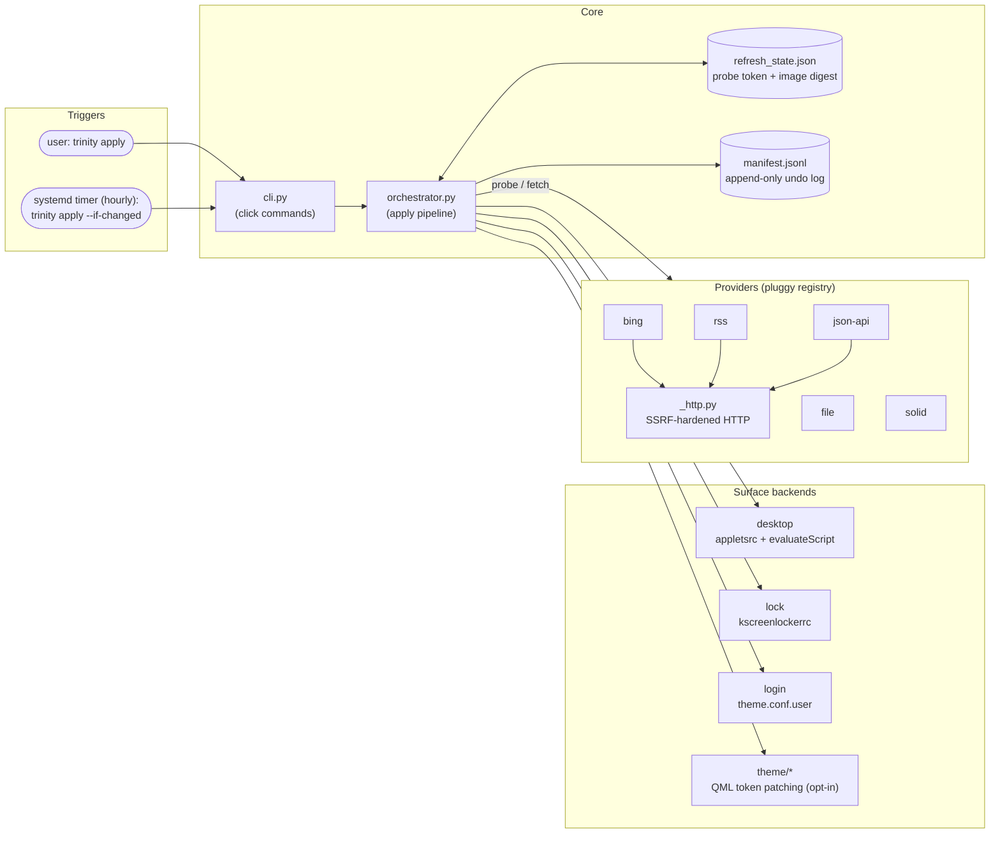
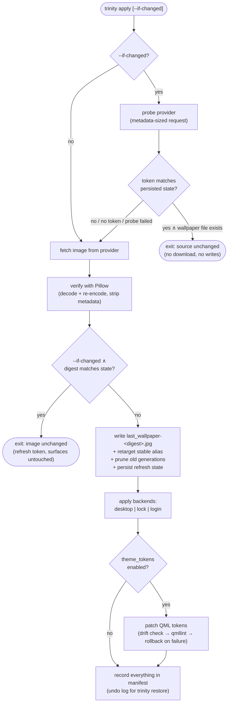

<div align="center">
  <h1>✨ Trinity ✨</h1>
  <p><strong>Unified Plasma 6 surface-set manager — desktop, lock screen, and SDDM login, in sync.</strong></p>

  [](https://www.python.org/downloads/)
  [](https://kde.org/plasma-desktop/)
  [](LICENSE)
  [](https://github.com/MattCreigh/uniquesurface/actions/workflows/ci.yml)
  [](https://github.com/MattCreigh/uniquesurface/actions/workflows/upstream-canary.yml)

</div>

> [!NOTE]
> **AI-Assisted Development**
> Portions of this codebase were developed with the assistance of generative AI. The code is fully tested, but please review it before deploying in mission-critical environments.

One CLI, one config file, **three surfaces**: desktop, lock screen, and SDDM login screen, kept synchronized.

## Contents

- [Why trinity?](#-why-trinity)
- [Architecture](#-architecture)
- [Quickstart](#-quickstart)
- [Providers](#-providers)
- [Configuration](#%EF%B8%8F-configuration)
- [How it works](#-how-it-works)
- [Security model](#-security-model)
- [Repository layout](#-repository-layout)
- [Briefing for AI / LLM contributors](#-briefing-for-ai--llm-contributors)
- [Documentation](#-documentation)
- [Development](#-development)
- [License](#-license)

---

## 🌟 Why `trinity`?

Existing wallpaper tools like `variety` or `nitrogen` only handle the desktop. GUI projects often patch vendor files irreversibly and brick systems after a KDE update.

`trinity` is the **CLI-first, reversible, systemd-automated** option for KDE Plasma 6 users who want a cohesive look across all three surfaces — and trust that their visuals (and their login screen) will stay intact.

### ✨ Key features

- **Total cohesion** — one wallpaper applied to desktop and lock screen at once, plus SDDM login when run with root.
- **Provider registry** — built-in Bing Picture of the Day, RSS/Atom image feeds, generic JSON APIs, local files, and solid colours; built on a [`pluggy`](https://pluggy.readthedocs.io/) hook model (third-party entry-point loading is implemented but not validated with an external package yet).
- **Live refresh that actually repaints** — wallpaper files are content-addressed, so Plasma repaints the moment a new image lands (see [Why content-addressed filenames](#why-content-addressed-filenames)).
- **Cheap change detection** — the hourly timer runs `apply --if-changed`: a metadata-sized probe per provider; the image is only downloaded (and surfaces only rewritten) when the source actually published a new picture.
- **Atomic rollbacks** — every file change is written to an append-only undo log. `trinity restore` replays the inverse operations newest-first.
- **Safe QML patching** — sentinel-based patching with drift detection. If an upstream KDE update alters a file, `trinity` detects the drift instead of bricking your login screen.
- **Strict configuration** — pydantic-validated TOML schema catches typos before they reach your system.

---

## 🏗 Architecture



Module-level responsibilities are tabulated in [Repository layout](#-repository-layout).

---

## 🚀 Quickstart

### Requirements

- **KDE Plasma 6** (tested on 6.7 / Neon 24.04)
- **Python 3.12+**
- `kwriteconfig6` and `qdbus6` (provided by your Plasma installation)
- [`uv`](https://docs.astral.sh/uv/) (recommended installer) or `pip`

### Install

```sh
# from a local clone
uv tool install .

# …or directly from GitHub
uv tool install git+https://github.com/MattCreigh/uniquesurface.git
```

This installs the `trinity` console script on your PATH.

### First-time setup

The easiest path is the all-in-one `trinity setup` command, which chains
config generation → install → dry-run → apply:

```sh
trinity setup            # interactive; pass --yes to skip prompts
```

Or step by step:

```sh
trinity config init      # write a starter config
# edit ~/.config/trinity/config.toml (see docs/config-reference.md)
sudo trinity install     # font, shared dir, systemd timer (root for system parts)
trinity apply --dry-run  # preview without writing
trinity apply            # desktop + lock screen + login (login needs root)
```

> The `sudo` is only for the system-wide font, `/usr/local/share/wallpapers`, and SDDM theme steps; the systemd user timer is enabled under your own desktop user.

### Theme tokens (opt-in)

The default config disables QML patching (`[surface.theme_tokens]
enabled = false`) — the simple wallpaper-sync use case doesn't need it.
Set `enabled = true` if you want trinity to patch the login/lock screen
font and theme tokens (the `fonts`, `login`, and `lock` config sections
only take effect when this is enabled).

### Command reference

```sh
trinity apply                # fetch + verify + apply to all three surfaces
trinity apply --dry-run      # print the plan without writing
trinity apply --if-changed   # skip everything when the source is unchanged (used by the timer)
trinity apply --adopt-drift  # accept changed vendor QML as the new baseline (explicit consent)
trinity apply --restart-dm   # ALSO restart the display manager (terminates your session; needs root)
trinity status               # show config + recent manifest entries
trinity doctor               # verify drift, fonts, config, permissions
trinity restore              # revert every recorded change
trinity pause / resume       # mask / re-enable the refresh timer
trinity provider list        # registered providers
trinity uninstall            # disable timer, remove unit files
```

---

## 🧩 Providers

| Provider   | Source                                             | Key options                                             | Change-probe token                  |
|------------|----------------------------------------------------|---------------------------------------------------------|-------------------------------------|
| `bing`     | Bing Picture of the Day (`HPImageArchive` API)     | `mkt`, `resolution`, `index`, `timeout`                 | market + image hash (`hsh`)         |
| `rss`      | Any RSS 2.0 / Atom feed carrying images            | `url` (https), `index`, `headers`, `timeout`            | resolved image URL                  |
| `json-api` | Generic HTTPS JSON metadata → image URL recipe     | `metadata_url`, `image_url_pointer` (RFC 6901), `params`, `headers`, `timeout` | resolved image URL |
| `file`     | Local image file (allow-listed roots only)         | `path`                                                  | path + mtime + size                 |
| `solid`    | Generated solid colour / two-stop gradient         | `color`, `gradient_to`, `width`, `height`, `quality`    | digest of the options               |

The *probe token* is what `apply --if-changed` compares between runs — an
opaque string that changes exactly when the wallpaper would (see
[Change detection](#change-detection-apply---if-changed)).

The `rss` provider resolves an item's image in this precedence order:
RSS 2.0 `enclosure` (image type) → Media RSS `media:content` /
`media:thumbnail` (directly or inside `media:group`) → Atom
`link rel="enclosure"` → the item `<link>` itself when its path ends in
an image extension.

```toml
[surface.source]
provider = "rss"

[surface.source.options]
url = "https://www.nasa.gov/feeds/iotd-feed/"   # https only
index = 0                                       # 0 = newest item
```

Inspect any provider's option schema from the CLI:

```sh
trinity provider info bing
```

Built-ins are registered through [`pluggy`](https://pluggy.readthedocs.io/). Third-party entry-point loading is also implemented in `make_plugin_manager` via `importlib.metadata.entry_points(group="trinity.providers")`; see [`src/trinity/providers/README.md`](src/trinity/providers/README.md).

---

## ⚙️ Configuration

Config lives at `~/.config/trinity/config.toml`. A minimal example:

```toml
[surface]
schema_version = 1

[surface.source]
provider = "bing"

[surface.source.options]
mkt = "en-US"
resolution = "1920x1080"
index = 0          # 0 = today, 1 = yesterday, …

[surface.theme_tokens]
enabled = false    # QML patching is opt-in

[surface.behaviour]
shared_dir = "/usr/local/share/wallpapers"
user_dir = "~/.local/state/trinity"
```

Full reference: [`docs/config-reference.md`](docs/config-reference.md).

---

## 🔧 How it works

Notation used below: `∧` and, `∨` or, `¬` not, `→` implies, `↔` if-and-only-if.

### The apply pipeline



Every backend is **best-effort**: `fail(backend_i) ↛ abort(pipeline)` — one
failing surface (e.g. login without root) is reported as a warning while the
others still apply.

### Why content-addressed filenames

Plasma's `org.kde.image` plugin does **not** watch file contents, and KConfig
only signals when a value changes:

```text
P1.  repaint(plasma)      ↔  changed(Image= value)
P2.  fixed filename       →  ¬changed(Image= value)        (even when bytes change!)
∴    fixed filename       →  ¬repaint(plasma)              — the historical bug
```

So every image is written under a name derived from its bytes, and a stable
symlink serves consumers that resolve the path at read time (SDDM re-reads the
image at every greeter start):

```text
/usr/local/share/wallpapers/
├── last_wallpaper-3f92c1a07d44.jpg   ← current generation (new digest ⇒ new URI ⇒ repaint)
├── last_wallpaper-9be02d117a3c.jpg   ← previous generation (kept; pruned at N-2)
└── last_wallpaper.jpg → last_wallpaper-3f92c1a07d44.jpg   ← stable alias for SDDM
```

```text
P3.  new image bytes      →  new digest  →  new URI        ⇒ repaint  (fixes P1/P2)
P4.  greeter start        →  re-read(alias path)           ⇒ SDDM always shows the current image
P5.  alias retarget is atomic (symlink + rename)           ⇒ the stable path always resolves
```

### Change detection: `apply --if-changed`

State from the last apply is persisted in `<user_dir>/refresh_state.json`
(source fingerprint, provider probe token, image digest, wallpaper path).
With `S` = valid persisted state whose fingerprint matches the current config,
`T` = fresh probe token (`∅` if the provider has no probe or it failed):

```text
R1 (probe skip):   S ∧ T≠∅ ∧ T = S.token ∧ exists(S.wallpaper)   →  exit, nothing done
R2 (digest skip):  S ∧ sha256(image) = S.digest ∧ exists(shared) →  refresh token, exit
R3 (fail open):    corrupt state ∨ probe error                   →  full apply (refresh is never blocked)
R4 (config edit):  fingerprint mismatch                          →  S treated as absent → full apply
```

Steady-state cost of the hourly timer is therefore **one metadata-sized
request** (rule R1). Providers without a probe converge via R2 (one image
download, no surface writes). A plain `trinity apply` ignores all four rules
and always applies — use it to force surface rewrites.

### Surfaces and privileges

| Surface | Written file | Mechanism | Takes effect |
|---|---|---|---|
| Desktop | `plasma-org.kde.plasma.desktop-appletsrc` (nested `[Containments][<id>][Wallpaper][org.kde.image][General] Image=`) | `kwriteconfig6` + live `qdbus6 … evaluateScript` | immediately |
| Lock | `kscreenlockerrc` (`[Greeter]…Image=`) | `kwriteconfig6` + D-Bus reconfigure | next lock |
| Login | `theme.conf.user` — the sanctioned SDDM override; the vendor file is never edited. Wallpaper-only mode writes it next to the vendor Breeze theme's `theme.conf`; with `theme_tokens` enabled it lives inside the `trinity-breeze` fork (below). Points at the stable alias. On plasmalogin systems, a drop-in at `/etc/plasmalogin.conf.d/trinity.conf` is written instead. | atomic write (root) | next greeter start (logout/boot) |

```text
restart(display_manager) ↔ --restart-dm ∧ login_applied ∧ dm_detected ∧ (root ∨ sudo/pkexec)
```

Trinity **never** restarts the display manager on its own — that would kill
your session. Without the flag you get a hint; with the flag but without
privilege you get an explanation.

### QML patching and drift (opt-in)

When `theme_tokens.enabled`, trinity patches font/lock/login tokens into
QML between sentinel comments. The two lockscreen files are patched in
place; the SDDM `Login.qml` is **never** patched in the vendor theme —
instead the whole Breeze theme is copied to
`/usr/share/sddm/themes/trinity-breeze/`, the fork's copy is patched, and
a drop-in at `/etc/sddm.conf.d/trinity.conf` (`[Theme] Current=trinity-breeze`)
selects it, so a Plasma upgrade can't clobber the greeter edits. The fork
is content-addressed against its vendor source: it is only re-copied when
the vendor theme actually changes, and the drop-in is re-written only when
missing. Disabling `theme_tokens` removes both. All patching is guarded by
three rules:

```text
D1.  ¬matches(target, pristine baseline)  →  backup + raise DriftError   (never patch drifted files)
D2.  adopt(drifted content as baseline)   ↔  explicit consent (--adopt-drift ∨ qml-update-templates)
D3.  qmllint fails after patching         →  roll the file back to pristine (fail closed)
```

Drift backups are capped at the 3 newest per vendor file. Patch anchors are
data-driven per Plasma version (`theme/descriptors/`), and a weekly
[Upstream Canary](.github/workflows/upstream-canary.yml) CI job checks them
against KDE's current sources before a Plasma update can surprise you.

### Scheduling

`trinity install` writes and enables a systemd **user** timer:

```text
trinity-pull.timer    OnCalendar=hourly, RandomizedDelaySec=10min, Persistent=true
trinity-pull.service  ExecStart=trinity apply --if-changed   (hardened, oneshot)
```

`Persistent=true` catches up a run missed while the machine slept, so a new
image lands promptly after wake. The service template deliberately omits
capability-dropping directives (`ProtectClock=`, `ProtectKernelModules=`):
user managers cannot apply them and the unit would fail to start on
Ubuntu-24.04-based systems.

### Reversibility

Every write is recorded in an append-only JSONL manifest with content hashes
and pre-image snapshots. `trinity restore` replays inverse operations
newest-first. Design principles throughout:

- **No shell scripts** — 100% Python with a full test suite.
- **Atomic I/O** — temp-then-replace with `fsync`.
- **Idempotent** — re-running produces the same state, no duplicates.
- **Reversible** — every write is tracked.

---

## 🔒 Security model

All network providers share one hardened HTTP layer (`providers/builtin/_http.py`):

```text
∀ request:  scheme = https
          ∧ resolve(host) ∩ {private, loopback, link-local, reserved, multicast} = ∅   (pre-flight, every redirect hop)
          ∧ redirects ≤ 5  ∧  |metadata| ≤ 5 MiB  ∧  |image| ≤ 50 MiB
```

- Feed XML is parsed with **defusedxml**: entity expansion (billion laughs), external entities (XXE), and DTD retrieval are rejected outright.
- Every downloaded image is **decoded and re-encoded with Pillow** before use — invalid files are rejected and metadata (EXIF) is stripped.
- The `file` provider only reads from allow-listed roots (`~/Pictures`, `~/Wallpapers`, the system wallpaper dirs, `$TRINITY_SHARED_DIR`).
- The systemd service runs sandboxed (`ProtectSystem=strict`, `PrivateTmp`, seccomp filters, restricted address families).
- Third-party providers are a supply-chain surface: they run as your user. Only install ones you trust.

---

## 📁 Repository layout

```text
src/trinity/
├── cli.py               # click commands: apply/status/doctor/restore/install/…
├── orchestrator.py      # the apply pipeline (fetch → verify → write → backends → QML → manifest)
├── refresh_state.py     # persisted probe-token/digest state for --if-changed
├── manifest.py          # append-only undo log + snapshots + restore/compact
├── atomic.py            # temp+fsync+rename atomic writes
├── config.py, schema.py # TOML loading + strict pydantic models (theme_tokens migration)
├── paths.py             # XDG paths, shared-dir resolution ($TRINITY_SHARED_DIR)
├── logging_setup.py     # structlog configuration
├── providers/
│   ├── __init__.py      # pluggy hookspecs (name/info/fetch/options_schema/probe) + registry + dispatch
│   └── builtin/         # bing.py, rss.py, json_api.py, file.py, solid.py, _http.py (shared SSRF-hardened HTTP)
├── backends/
│   ├── desktop.py       # appletsrc containments + live evaluateScript
│   ├── lock.py          # kscreenlockerrc
│   ├── login.py         # SDDM theme.conf.user (sanctioned override)
│   ├── sddm_fork.py     # Tier-2: forked "Trinity Breeze" theme + /etc/sddm.conf.d drop-in
│   └── _kconfig.py      # kwriteconfig6 / qdbus6 wrappers
├── theme/
│   ├── extract.py       # pristine QML template extraction
│   ├── drift.py         # drift detection, backups (capped), DriftError
│   ├── qml_patch.py     # sentinel-based font/lock token patching
│   ├── qmllint.py       # post-patch validation (fail closed)
│   ├── descriptors/     # per-Plasma-version patch anchors (TOML, canary-tested)
│   └── font_install.py  # bundled Inter font installation
└── systemd/writer.py    # unit templates + install/enable/pause/resume

tests/                   # pytest suite (hermetic; respx for HTTP, tmp XDG dirs)
docs/                    # config reference, migration guide, design notes
```

---

## 🤖 Briefing for AI / LLM contributors

This section is the contract for automated changes. Read it (and
[`PLAN.md`](PLAN.md)) before modifying the codebase.

**Invariants — do not violate:**

1. **Never restart the display manager automatically.** Restart requires the explicit `--restart-dm` flag *and* privilege (see gating formula above).
2. **Never adopt drifted vendor QML silently** (D1–D3 above). Consent is `--adopt-drift` or `qml-update-templates`, nothing else.
3. **A new wallpaper must be a new URI** (P1–P3). Do not reintroduce fixed-filename overwrites; keep the stable alias resolving at all times.
4. **All provider HTTP goes through `_http.py`**: HTTPS-only, SSRF pre-flight on every hop, size and redirect caps. XML parsing goes through `defusedxml` only. Images are re-encoded via `verify_image` before touching disk.
5. **Every system write is manifest-tracked** (`write_tracked`) so `restore` stays complete.
6. **`--if-changed` fails open** (R3). A probe or state problem degrades to a full apply — it must never block the refresh.
7. **User systemd units must not use capability-dropping directives** (`ProtectClock=`, `ProtectKernelModules=`) — they fail to start under user managers on Ubuntu-24.04-based distros. There is a regression test.
8. **Tests must be hermetic.** Always set `[surface.behaviour]` dirs to tmp paths, disable `theme_tokens` (the omitted-key auto-migration *enables* it) or stub `extract.DEFAULT_TARGETS`, and stub `LoginBackend` — it writes hardcoded system paths that are user-writable on some machines.
9. **Provider options are strict pydantic schemas** (`extra="forbid"`), validated at config load; a new provider must implement `trinity_provider_name/info/fetch/options_schema` and should implement `trinity_provider_probe` (cheap, metadata-only; return an opaque token, or `None` if probing is impossible).
10. **SDDM greeter QML is patched only in the `trinity-breeze` fork** (`backends/sddm_fork.py`), selected via the `/etc/sddm.conf.d/trinity.conf` drop-in — the vendor Breeze theme's `Login.qml` is never edited. The fork step is best-effort (a permission failure must not abort `apply`; desktop/lock still update) and idempotent (re-copied only when the vendor theme's content digest changes, drop-in rewritten only when missing, both skipped when plasmalogin is the greeter).

**Quality gates (all must pass before any commit):**

```sh
uv run pytest -q                       # full suite, coverage floor 75%
uv run ruff check src tests
uv run ruff format --check src tests
uv run mypy src                        # strict mode
```

**Update discipline:** bump `src/trinity/__init__.py:__version__`, document
user-visible changes in `CHANGELOG.md` (Keep-a-Changelog), and keep this
README's diagrams/formulas in sync with behavior — they are load-bearing
documentation, not decoration.

---

## 📖 Documentation

- [**PLAN.md**](PLAN.md) — design, architecture, and implementation spec.
- [**Config reference**](docs/config-reference.md) — every configuration key.
- [**Migration guide**](docs/migration-from-shell.md) — coming from a shell-based setup.
- [**CHANGELOG.md**](CHANGELOG.md) — release history.

---

## 🧪 Development

```sh
git clone https://github.com/MattCreigh/uniquesurface.git
cd uniquesurface
uv sync --group test   # create venv + install dev & test deps
uv run pytest -q       # run the test suite
uv run ruff check src tests
uv run ruff format --check src tests
uv run mypy src
```

See [CONTRIBUTING.md](CONTRIBUTING.md) for the full quality gates and
PR process.

---

## 📜 License

The trinity source code is licensed under [GPL-3.0-or-later](LICENSE).

The bundled Inter font (`src/trinity/theme/fonts/Inter-Regular.ttf`) is
licensed under the [SIL Open Font License 1.1](src/trinity/theme/fonts/OFL.txt)
and is not subject to the GPL.

---

<div align="center">
  <i>Crafted with 🩵 for KDE Plasma.</i>
</div>
